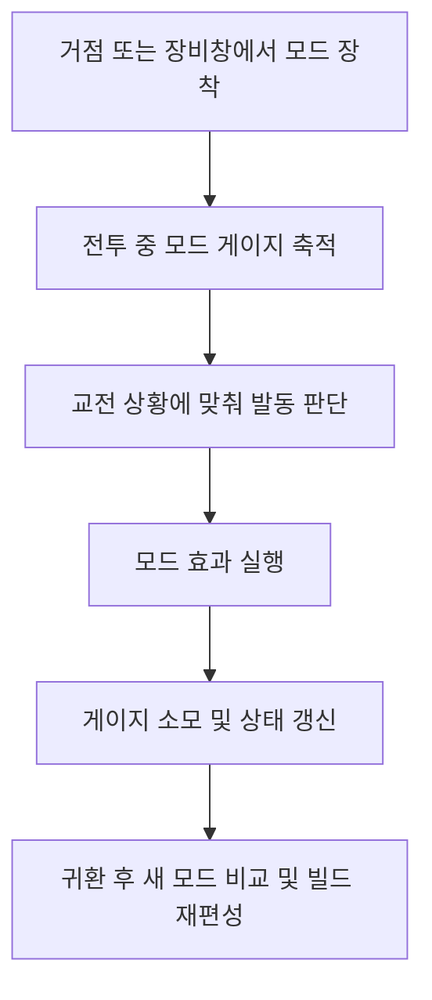

# [시스템 기획] 무기_모드

생성자: 이건주
카테고리: 기획  
생성 일시: 2026년 4월 20일  

> **작성 목적:** 무기에 장착하는 모드(Weapon Mod)의 기획 목표, 장착/교체 규칙, 발동 구조, 시스템 책임 분리, 데이터 요구사항을 명세한다.

---

## 목차

1. [시스템 목표](#1-시스템-목표)
2. [코어 루프에서의 역할](#2-코어-루프에서의-역할)
3. [시스템 범위와 책임 분리](#3-시스템-범위와-책임-분리)
4. [설계 원칙](#4-설계-원칙)
5. [모드 발동 패턴](#5-모드-발동-패턴)
6. [장착/교체/해제 규칙](#6-장착교체해제-규칙)
7. [모드 데이터 구조](#7-모드-데이터-구조)
8. [UI/HUD 요구사항](#8-uihud-요구사항)
9. [저장/네트워크/멀티플레이 고려사항](#9-저장네트워크멀티플레이-고려사항)
10. [현 단계 정책 정리](#10-현-단계-정책-정리)
11. [다음 단계 권장 사항](#11-다음-단계-권장-사항)

---

## **1. 시스템 목표**

무기 모드는 동일한 무기라도 장착 구성에 따라 전혀 다른 전투 리듬과 역할을 만들 수 있어야 한다. 플레이어는 같은 돌격소총을 들더라도 어떤 모드를 붙였는지에 따라 교전 방식, 위기 대응 수단, 보스 대응 패턴이 달라져야 한다.

무기 모드 시스템은 아래 경험을 제공해야 한다.

- 같은 무기군을 반복 사용하더라도 빌드 차별화와 재플레이 가치를 만든다.
- 기본 사격만으로 해결하기 어려운 순간에 능동적으로 전투 흐름을 뒤집는 선택지를 제공한다.
- 탐색과 보스 처치 보상이 다음 출격의 빌드 재편성으로 이어지게 만든다.
- 무기 정체성을 해치지 않으면서도, 플레이어가 선호하는 전술 방향을 더 뚜렷하게 강화한다.

즉, 무기 모드는 단순 부가 옵션이 아니라 **무기 빌드의 액티브 전술 슬롯**이어야 한다.

---

## **2. 코어 루프에서의 역할**

무기 모드 시스템은 출격 전 빌드 준비와 전투 중 전술 판단을 연결하는 장치다.

무기 모드 시스템은 이 루프 안에서 아래 역할을 가진다.

- 출격 전: 현재 무기와 시너지가 맞는 모드를 선택하게 한다.
- 전투 중: 게이지가 차더라도 즉시 사용하지 않고, 더 가치 있는 타이밍을 고민하게 만든다.
- 보스전: 페이즈 전환, 그로기 타이밍, 난전 탈출 같은 특정 순간에 전술적 해결책이 된다.
- 귀환 후: 새로 획득한 모드를 기반으로 다음 세션 빌드를 다시 구성하게 만든다.

---

## **3. 시스템 범위와 책임 분리**

무기 모드 시스템은 "누가 모드를 소유하고, 누가 입력을 전달하며, 누가 데이터를 표시하는가"를 명확히 분리해야 한다.

| 주체 | 책임 | 비고 |
| --- | --- | --- |
| 무기 인스턴스 |  |  | //fill
| 무기 컴포넌트 |  |  | //fill
| 장비창(장비 슬롯) | 모드 장착/교체/분리, 호환성 검사, 장비 슬롯별 구성 저장 | 장비 편성 담당 |
| HUD/UI | 아이콘, 이름, 게이지, 발동 가능 상태, 지속 시간, 실패 사유 표시 | 데이터 출력 전용 |
| 아이템/인벤토리 시스템 | 모드 획득, 보유 목록 관리, 드롭/보상 분배, 중복 획득 처리 | 소유권과 수량 관리 담당 |
| 전투 게이지/상태 시스템 | Mod 게이지 충전 정책, 상태이상/장판 등 전투 결과 규칙 정의 | 발동 결과의 전투 규칙 담당 |

위 책임 분리를 통해 각 시스템은 아래 원칙을 따른다.

- 무기 컴포넌트는 //fill
- 모드별 실제 전투 로직은 플레이어에게 부여한 모드 어빌리티가 구현한다
- HUD/UI는 판단을 하지 않고 현재 상태를 표시만 한다.
- 인벤토리는 소유권을 관리하지만, 발동 로직을 알 필요는 없다.

---

## **4. 설계 원칙**

### **4.1 모드는 액티브 전술 장치다**

- 모드는 키 입력으로 발동하는 액티브 성향의 시스템으로 설계한다.
- 패시브 수치 상승이 아니라, 플레이어가 "언제 쓸지" 판단해야 가치가 생긴다.
- 특정 상황에서 강한 해답을 제공하는 방향이 적합하다.

### **4.2 //fill**

- 무기 컴포넌트는 //fill
- 무기 인스턴스는 장착한 모드를 보유하며, 모드 슬롯 활성화 시 모드 어빌리티를 부여, 비활성화 시 회수한다
- 플레이어 어트리뷰트셋은 Mod 게이지, Mod 스택 등을 담당한다.
- 

### **4.3 확장 가능한 공통 생명주기를 가진다**

모든 모드는 아래 공통 단계를 따른다.

1. 발동 요청 수신
2. 사용 가능 여부 검사
3. 모드 어빌리티 실행
4. 지속/종료 처리
5. 결과 정리 및 HUD 갱신

새 모드를 추가할 때는 이 생명주기를 따르기만 하면 되도록 설계한다. 즉, 모드 종류가 늘어나도 입력 처리, HUD 계약, 장비창 구조를 매번 수정하지 않는 것이 목표다.

### **4.4 무기 정체성을 보완하는 방향을 우선한다**

- 모드는 무기 역할을 강화하거나 보완해야 한다.
- 어떤 모드가 붙더라도 무기군 고유의 사거리, 템포, 조작 난이도를 완전히 지우면 안 된다.
- 특정 모드 1종이 모든 무기에서 사실상 정답처럼 사용되는 구조는 지양한다.

---

## **5. 모드 발동 패턴**

모드는 어빌리티가 모드 사용 입력 태그를 공통 입력으로 사용한다.

### **5.1 기본 발동 패턴 분류**

| 패턴 | 설명 | 예시 |
| --- | --- | --- |
| 사격 모드 전환형 | 모드 사용 입력 시 기본 사격 어빌리티를 회수, 모드 사격 어빌리티를 부여한다. 특수 탄 사용 | 기본 사격 모드 ↔ 모드 사격 모드 전환, 모드 탄 사용 |
| 자기 강화형 | 모드 사용 입력 시 일정 시간 동안 무기 또는 캐릭터에 버프를 부여하고, 기본 사격을 강화 | 기본 사격 피해 증가, 피격 시 화상/출혈 적용 |
| 소환/배치형 | 모드 사용 입력 시 소환체, 터렛, 장판, 디코이(어그로 미끼) 등 월드 오브젝트를 생성 | 소환체 소환, 지원 장치 배치 |
| 즉발/타격형 | 모드 사용 입력 시 입력 즉시 특수 투사체, 충격파, 폭발 등 단발 효과 실행 | 특수 탄환 발사, 광역 제압 스킬 |

위 패턴은 초안 기준의 대표 사례이며, 이후 아래 유형까지 확장 가능해야 한다.

- 채널링형
- 표식 부여형
- 아군 지원형
- 이동/회피 연계형

### **5.2 발동 패턴 공통 규칙**

- 모든 모드는 동일 입력을 사용하되, 부여된 모드 어빌리티에 따라 처리 방식만 달라진다.
- 현재 기본 방향은 **게이지 100% 도달 시 사용 스택 1개가 충전되는 구조**를 기준으로 하며, 최대 스택 수까지 누적 충전할 수 있다.
- 발동 성공 여부는 어빌리티가 최종 판단한다
- 발동 실패 시 HUD/UI에 실패 사유를 즉시 제공해야 한다.

### **5.3 발동 흐름**

1. 플레이어가 모드 입력을 수행한다.
2. 부여된 어빌리티가 태그를 수신한다
3. 어빌리티가 게이지, 행동 가능 상태를 검증한다.
4. 모드 어빌리티의 실행 로직을 수행한다.
5. 발동 성공 시 GE로 자원을 소비하고, 필요한 버프/투사체/소환체/상태를 생성한다.
6. HUD/UI가 새 상태를 갱신한다.

---

## **6. 장착/교체/해제 규칙**

### **6.1 기본 장착 규칙**

- 무기마다 최대 1개의 모드 슬롯을 가진다.
- 모드는 인벤토리 또는 장비창에서 장착/교체한다.
- 모드 호환성은 무기 타입 또는 무기 태그 기준으로 검사한다.

### **6.2 교체 처리**

1. 장착 대상 무기 슬롯 선택
2. 인벤토리에서 모드 아이템 선택
3. 호환 여부 및 잠금 상태 검사
4. 기존 장착 모드가 있으면 분리 후 인벤토리 반환
5. 새 모드 장착 및 무기 액터 상태 갱신
6. 장착 완료 후 모드 게이지 초기화

게이지를 초기화하는 이유는 장비창을 이용한 사전 충전 악용을 방지하고, 새 모드 장착 시 전술 준비 비용을 유지하기 위함이다.

### **6.3 해제 처리**

- 모드 해제 시 해당 모드는 인벤토리로 반환된다.
- 무기 액터의 모드 런타임 상태는 즉시 초기화된다.
- HUD에서는 해당 무기의 모드 정보가 숨겨진다.

### **6.4 무기 전환과의 관계**

- 모드 소유권과 런타임 상태는 무기 인스턴스 단위로 관리한다.
- HUD는 주무기/보조무기 슬롯 상태를 동시에 유지할 수 있으며, 현재 활성 무기를 강조 표시한다.
- 비활성 무기의 모드 상태는 해당 무기 액터 내부에 유지되며, 재장착 시 이어서 사용한다.
- 사격 모드 전환형 Mod는 무기 비활성화 시 즉시 종료되며, 현재 활성 사격 상태는 기본 사격 프로파일로 복귀한다.
- 버프형 및 소환형 모드는 무기 전환을 허용하며, 전환 후에도 이미 적용된 버프와 소환 상태는 유지된다.
- 버프형 및 소환형 모드의 남은 지속 시간은 무기 비활성 상태에서도 계속 감소한다.

### **6.5 게이지 회복 정책**

- 모드 교체 직후에는 해당 무기의 모드 게이지를 0으로 초기화한다.
- 체크포인트 활성화, 거점 귀환, 맵 이동 후 전투 재개, 사망 후 복귀 시 모드 게이지는 최대치로 충전한다.
- 위 정책은 전투 시작 시 준비 시간을 줄이고, 모드 사용을 전투 개시 선택지로 활용할 수 있게 하기 위함이다.

---

## **7. 모드 데이터 구조**

### **7.1 모드 마스터 데이터**

모드의 정적 정보는 마스터 데이터로 관리한다.

| 항목 | 설명 |
| --- | --- |
| Mod 식별자 | 모드 고유 ID |
| 표시 이름 | 인게임 표시 이름 |
| 모드 카테고리 | 공격 / 제어 / 지원 / 소환 등 역할 분류 |
| 발동 프로파일 | 즉발형 / 전환형 / 버프형 / 소환형 등 실행 방식 |
| 호환 무기 태그 | 장착 가능한 무기 타입 또는 태그 목록 |
| 최대 스택 | 누적 충전 가능한 최대 모드 사용 횟수 |
| 최대 게이지 | 기본 발동에 필요한 최대 게이지 수치 |
| 게이지 소비 정책 | 발동 시 전량 소모 여부, 예외 정책 |
| 기본 지속 시간 | 버프/소환/전환 상태 유지 시간 |
| 발동 조건 | 발동 가능 상태를 판단하는 조건 |
| 효과 설명 | UI 노출용 설명 텍스트 |
| 어빌리티/이펙트 세트 | 실제 실행할 전투 기능 참조 |
| 아이콘/연출 리소스 | HUD, 인벤토리, 이펙트 표시용 리소스 |

### **7.2 모드 런타임 상태**

모드의 전투 중 상태는 무기 인스턴스가 보유한다.

| 항목 | 설명 |
| --- | --- |
| 장착 무기 인스턴스 | 현재 모드를 보유한 무기 액터 |
| 현재 장착 Mod ID | 런타임 기준 장착 모드 식별자 |
| 현재 게이지 | 실시간 충전량 |
| 현재 스택 | 현재 사용 가능한 Mod 스택 수 |
| 발동 상태 | 대기 / 준비 완료 / 실행 중 / 종료 처리 중 |
| 남은 지속 시간 | 버프형, 소환형, 전환형 종료 판단용 |
| 보조 상태값 | 소환체 핸들, 버프 스택 등 모드별 추가 상태 |
| 최근 실패 사유 | `LastModFailureReason` 기준 HUD/UI 피드백용 사용 불가 원인 |

- 사격 모드 전환형 Mod는 특수 탄 수를 별도 상태로 두지 않고, Mod 스택으로 통합해 관리한다.

---

## **8. UI/HUD 요구사항**

무기 모드 시스템은 플레이어가 현재 모드 상태를 즉시 읽을 수 있어야 성립한다.

| 영역 | 요구사항 |
| --- | --- |
| 전투 HUD | 현재 장착 모드 아이콘, 이름, 게이지, 발동 가능 상태 표시 |
| 전투 HUD | 실행 중인 모드의 남은 지속 시간 또는 활성 상태 표시 |
| 전투 HUD | 모드 사격 전환형일 경우 현재 사격 상태와 특수 탄 사용 여부 표시 |
| 장비창 | 현재 장착 모드, 교체 대상 모드, 호환 가능/불가 사유 표시 |
| 인벤토리 | 모드 역할 태그, 효과 설명, 장착 중 여부, 비교 정보 표시 |
| 피드백 | 게이지 부족, 사용 중, 행동 불가, 호환 불가 등 실패 사유를 명확히 출력 |

UI/HUD의 구체적인 배치와 시각 연출은 `UI_HUD` 문서에서 관리하되, 무기 모드 시스템은 위 정보를 제공할 수 있어야 한다.

---

## **9. 저장/네트워크/멀티플레이 고려사항**

### **9.1 저장**

- 해금된 모드 목록은 저장 대상이다.
- 장착 중인 모드 정보는 각 무기 데이터에 포함해 저장한다.
- 장비창은 주무기/보조무기 등 **무기 슬롯 구성 자체를 저장하는 주체**이며, 세이브 로드 시 슬롯 단위로 복원한다.
- `EquipmentComponent`는 슬롯 데이터만 저장하고, `WeaponComponent`는 이를 참조해 주무기/보조무기 무기 인스턴스를 생성·초기화한다.
- 무기 인스턴스 생성/초기화는 `BeginPlay`, 게임 시작, 맵 입장, 장비 변경 시점에 수행되며, 장비 변경은 `EquipmentComponent` 델리게이트 브로드캐스트를 통해 `WeaponComponent`에 전달한다.
- 보조무기 슬롯이 확정되면 세이브 구조는 주무기/보조무기별 무기 및 장착 모드 매핑으로 확장한다.
- 모드 게이지는 저장하지 않고, 체크포인트 활성화/거점 귀환/맵 이동 후 전투 재개/사망 후 복귀 시 최대치로 충전한다.

### **9.2 네트워크**

- 모드 게이지 수치, 발동 승인, 소환체 생성, 버프 적용, 피해 판정은 서버 권위로 처리한다.
- 클라이언트는 입력과 연출 요청을 보내고, 서버 결과를 기준으로 최종 상태를 반영한다.
- 모드 발동 실패도 서버 기준으로 확정되어야 한다.
- Mod 게이지, Mod 스택, 최근 실패 사유 같은 private 상태는 owner-only HUD 정보로 복제하고, 타인에게 보여야 하는 무기 표현과 애니메이션은 별도 공개 복제 경로로 처리한다.

### **9.3 멀티플레이**

- 모드 아이템 획득 분배는 인벤토리 시스템의 공유 획득 규칙을 따른다.
- 발동 주체는 모드를 사용한 플레이어의 무기 인스턴스다.
- 아군 버프형/지원형 모드는 적용 대상 규칙을 별도로 가져야 한다.
- 동일 Mod 중복 장착은 파티원 간에는 허용한다.
- 단일 플레이어 기준으로는 같은 Mod를 주무기와 보조무기에 중복 장착할 수 없으며, 하나의 Mod는 하나의 무기에만 장착한다.

---

## **10. 현 단계 정책 정리**

| 항목 | 현재 정책 |
| --- | --- |
| 모드 게이지 회복 | 체크포인트 활성화, 거점 귀환, 맵 이동 후 전투 재개, 사망 후 복귀 시 최대치로 충전 |
| 동일 Mod 중복 장착 | 파티원 간 중복 허용. 단일 플레이어는 동일 Mod를 주무기/보조무기에 중복 장착 불가 |
| 모드 실행 중 무기 전환 | 무기 전환 허용. 사격 모드 전환형은 종료 후 기본 사격으로 복귀, 버프형과 소환형은 효과와 소환 상태를 유지하며 남은 시간은 계속 감소 |
| 소환형 모드 최대 동시 소환 수 | 제한 없음 |
| 모드 교체 가능 구간 | 전투 중 교체 금지. 장비 UI에서 교체 기능 비활성화 |
| 슬롯별 저장 구조 | `EquipmentComponent`가 슬롯 구성을 저장하고, `WeaponComponent`는 이를 참조해 주무기/보조무기 무기 인스턴스를 초기화. 모드는 각 무기에 귀속되어 저장 |

---

*본 문서의 규칙과 분류는 초기 기획 기준이며, 플레이 테스트와 상세 설계를 통해 조정될 수 있다.*
