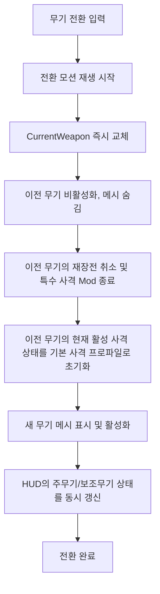
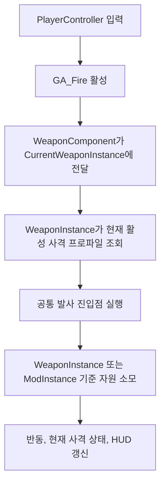
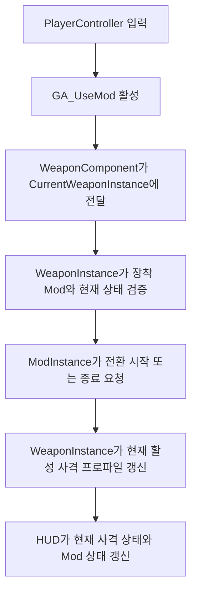

# [시스템 기획] 무기_장비

생성자: YUCHAN BAE  
카테고리: 기획  
생성 일시: 2026년 4월 16일  

> **작성 목적:** 무기 장착, 데이터 관리, 사격 프로파일, 기본 탄약, 반동 시스템의 동작 방식 및 데이터 구조를 구체적으로 명세한다.

---

## 목차

1. [무기 장착 및 교체](#1-무기-장착-및-교체)
2. [무기 데이터 관리](#2-무기-데이터-관리)
3. [탄약 시스템](#3-탄약-시스템)
4. [반동 시스템](#4-반동-시스템)

---

## 1. 무기 장착 및 교체

### 1.1 무기 슬롯 구성

| 슬롯 | 설명 |
| --- | --- |
| 주무기 슬롯 | 돌격소총, 유탄발사기, 볼트액션 중 1종 장착 |
| 보조무기 슬롯 | 권총 (TBD) |

- 초기 시작 시 기본 주무기 1종 장착 상태로 게임 시작
- 주무기는 월드 픽업 또는 거점 상점을 통해 변경
- 각 무기 슬롯은 `무기 인스턴스 1개 + 해당 무기에 장착된 Mod 1개`를 함께 관리한다
- `EquipmentComponent`는 주무기/보조무기 장비 데이터와 장착 Mod 데이터만 저장한다
- `WeaponComponent`는 `EquipmentComponent`의 주무기/보조무기 데이터를 참조해 `PrimaryWeaponInstance`, `SecondaryWeaponInstance`를 생성/초기화하고, `CurrentWeapon`을 현재 입력 라우팅 대상으로 관리한다
- 무기 인스턴스 생성/초기화는 `BeginPlay`, 게임 시작, 맵 입장, 장비 변경 시점에 수행하며, 장비 변경은 `EquipmentComponent` 델리게이트 브로드캐스트를 통해 `WeaponComponent`에 전달한다
- 비활성화 상태의 무기 인스턴스도 런타임에서 유지되며, 현재 탄창 잔탄, 보유 탄약, Mod 게이지, Mod 스택을 계속 보관한다
- 무기 인스턴스가 비활성화될 때 현재 활성 사격 상태는 기본 사격 프로파일로 초기화되고, 재장전 진행은 취소된다

### 1.2 무기 전환

- 무기 전환 입력(마우스 휠 또는 X) 시 장착 모션 재생
- 전환 딜레이: 0.4 초
- 무기 전환 입력이 수신되면 `CurrentWeapon` 참조는 즉시 새 무기로 교체된다
- 전환 모션 중에는 `추가 무기 전환 입력`만 차단한다
- 전환 모션 중에도 사격, 재장전, ADS, Mod 사용 입력은 차단하지 않으며, 항상 현재 `CurrentWeapon` 기준으로 처리한다
- 무기 전환으로 비활성화되는 무기의 `특수 사격 Mod`는 즉시 종료 처리된다
- 전환 완료 시 HUD는 주무기와 보조무기 상태 UI를 동시에 유지한 채, 새 활성 무기 상태를 갱신한다

### 1.3 무기 장착/해제 흐름

### 1.4 사격 모드 전환형 Mod의 장비 연동 범위

- 본 문서에서 확정하는 Mod 연동 규칙은 `사격 모드 전환형 Mod`, 즉 `특수 사격 Mod`에 한정한다
- 버프형, 소환형 Mod는 현재 활성 사격 상태를 전환하지 않으며, 본 문서의 사격 상태 전환 규칙 적용 대상이 아니다
- Mod는 현재 활성 사격 상태의 최종 소유자가 아니며, 무기 액터에게 사격 상태 변경을 요청하는 주체다
- 무기 컴포넌트는 입력 라우팅만 담당하며, Mod 종류별 분기나 전환 판단을 직접 보유하지 않는다
- 특수 사격 Mod 외 나머지 Mod의 일반 규칙은 `[시스템 기획] 무기_모드.md`에서 다룬다

### 1.5 사격 모드 전환형 Mod의 상태 전환 규칙

| 상황 | 처리 규칙 |
| --- | --- |
| 재장전 중 Mod 전환 입력 | 재장전을 중단하고 사격 상태를 전환 |
| 구르기 중 Mod 전환 입력 | 전환 허용 |
| 무기 전환 중 Mod 전환 입력 | 전환 허용. 입력은 현재 `CurrentWeapon`의 Mod에만 전달 |
| 죽음/다운 상태 | 입력 자체를 차단 |
| Mod 전환 입력 시 사용 횟수 스택 0 | 전환 불가. 기본 사격 상태 유지 |
| Mod 사용 횟수 스택 0 도달 | 자동으로 기본 사격으로 복귀 |
| 무기 비활성화 | 현재 활성 사격 상태를 기본 사격 프로파일로 초기화하고, 특수 사격 Mod는 종료 처리 |
| 무기 재장착 | 현재 활성 사격 상태를 기본 사격 프로파일로 초기화 |

- 지속 시간이 존재하는 버프형, 소환형 Mod는 본 규칙의 적용 대상이 아니므로 `지속 시간 종료 시 기본 사격 복귀` 규칙을 두지 않는다
- 사격 모드 전환형 Mod는 사용 횟수 스택이 0이 되면 현재 활성 사격 상태를 기본 사격 프로파일로 자동 복귀시킨다
- 사격 모드 전환형 Mod의 게이지와 스택은 무기 비활성화 후에도 유지되지만, 활성 사격 상태 자체는 유지하지 않는다

---

## 2. 무기 데이터 관리

### 2.1 무기 데이터 테이블 구조

모든 무기 스탯은 데이터 테이블로 관리하며 엑셀 연동을 통해 갱신한다. 사격 로직의 표현 단위는 `사격 프로파일`이며, 무기는 항상 기본 사격 프로파일을 소유한다.

| 항목 | 설명 |
| --- | --- |
| 무기 식별자 | 무기 고유 ID |
| 무기 타입 | 돌격소총 / 유탄발사기 / 볼트액션 |
| 기본 피해량 | 발당 기본 데미지 |
| 그로기 데미지 | 발당 그로기 게이지 피해량 |
| 발사 속도 | 초당 발사 횟수 |
| 탄창 용량 | 한 탄창의 최대 탄수 |
| 재장전 시간 | 전체 재장전 소요 시간 (초) |
| ADS FOV | ADS 시 적용 시야각(FOV) |
| 발사 방식 | 풀오토 / 단발 / 볼트액션 |
| 탄약 타입 | 소총탄 / 유탄 / 볼트탄 |
| 발사 방식 (투사체 여부) | 히트스캔 또는 투사체 |
| Mod 슬롯 수 | 0 ~ 1 |
| 기본 사격 프로파일 | 무기 기본 사격 규칙을 정의하는 프로파일 |

### 2.2 무기 타입별 기본 스탯 (기획 초안)

| 항목 | 돌격소총 | 유탄발사기 | 볼트액션 |
| --- | --- | --- | --- |
| 기본 피해 | 18 | 75 (직격) | 120 |
| 약점 보너스 비율 | +0.5x | +0x | +1.1x |
| 그로기 데미지 | 5 | 20 | 50 |
| 탄창 | 30 발 | 6 발 | 5 발 |
| 연사력 | 600 RPM | - | - |
| 재장전 시간 | 2.0 초 | 3.0 초 | 2.5 초 |
| 발사 방식 | 히트스캔 | 투사체 | 히트스캔 |
| 유효 사거리 | 1500 cm | 해당 없음 | 5000 cm |
| 최대 사거리 | 5000 cm | 해당 없음 | 제한 없음 |
| Damage Falloff | 유효 사거리 초과 시 선형 감쇠 (최대 40% 감소) | 해당 없음 (폭발 반경 감쇠는 전투_사격_판정 기획서 참조) | 감쇠 없음 |

**Damage Falloff 상세:**
- **돌격소총**: 유효 사거리 1500cm까지 피해량 100% 적용. 1500cm 초과 ~ 5000cm 구간에서 선형 감쇠. 5000cm 지점에서 최대 40% 피해 감소.
- **볼트액션**: 사거리 제한 없음, 어떤 거리에서도 피해 감쇠 없음.
- **유탄발사기**: 투사체 이동 방식으로 사거리 개념 미적용. 폭발 반경 내 피해 감쇠는 전투_사격_판정 기획서 참조.

### 2.3 사격 프로파일 구조

사격 프로파일은 `무기의 공통 발사 진입점이 지금 어떤 규칙으로 발사해야 하는지`를 정의하는 데이터 묶음이다. `AWeaponInstance`는 기본 사격 프로파일을 항상 보유하고, 사격 모드 전환형 Mod가 활성화된 동안에만 `ModInstance`가 `OverrideFireProfile`을 제공한다.

| 항목 | 설명 |
| --- | --- |
| 프로파일 식별자 | 현재 어떤 사격 프로파일이 활성인지 식별하는 키 |
| 발사 로직 참조 | 실제 사격 로직 또는 어빌리티 실행 대상 |
| 입력 방식 | 풀오토 / 단발 / 차지 등 발사 입력 처리 규칙 |
| 자원 소모 주체 | `WeaponInstance`의 기본 탄창/보유 탄약 또는 `ModInstance`의 Mod 스택 중 어느 쪽을 소비하는지 정의 |
| 판정 방식 | 히트스캔 / 투사체 / 특수 탄도 방식 |
| 발사 속도 | 해당 프로파일 기준 연사 속도 |
| 반동 프리셋 | 수직 반동, 수평 반동, 크로스헤어 확산 규칙 |
| HUD 사격 상태 | HUD에 표시할 현재 사격 상태 식별값 |
| 실패 사유 생성 주체 | `WeaponInstance` 또는 `ModInstance` 중 어떤 주체가 실패 사유를 결정하는지 정의 |

### 2.4 현재 활성 사격 상태와 책임 분리

- 현재 활성 사격 상태의 최종 소유자는 무기 액터다
- Mod는 현재 활성 사격 상태를 직접 소유하지 않고, 무기 액터에게 상태 전환을 요청하는 주체다
- `EquipmentComponent`는 슬롯 데이터만 저장하고, 런타임 인스턴스를 직접 소유하지 않는다
- `WeaponComponent`는 `PrimaryWeaponInstance`, `SecondaryWeaponInstance`, `CurrentWeapon`을 관리하며, 두 무기 인스턴스를 런타임에서 동시에 유지한다
- `AWeaponInstance`는 `BaseFireProfile`, 현재 탄창 잔탄, 보유 탄약, 재장전 상태, `LastWeaponFailureReason`을 보유한다
- `ModInstance`는 Mod 게이지, Mod 스택, `LastModFailureReason`을 보유하며, 필요 시 `OverrideFireProfile`을 제공한다
- 발사 입력이 들어오면 무기는 `현재 활성 사격 프로파일`만 조회하고 동일한 공통 발사 진입점으로 실행한다
- 무기 액터는 발사 시점마다 현재 활성 사격 프로파일을 조회해 실제 발사 데이터를 결정한다
- 무기 컴포넌트는 발사 입력, 재장전 입력, Mod 사용 입력을 현재 활성 무기에 전달하는 역할만 담당한다
- 비활성 무기의 `AWeaponInstance`와 `ModInstance`는 유지되며, 탄창 잔탄, 보유 탄약, Mod 게이지, Mod 스택은 계속 유지된다
- 반대로 비활성화 시점에 현재 활성 사격 프로파일은 기본 사격으로 초기화되고, 재장전 진행은 취소된다

### 2.5 사격 플로우

세부 입력 흐름은 `Docs/Private/Agent/사격 플로우.md`를 기준으로 정렬하며, 본 문서에서는 장비 시스템 관점의 확정 흐름만 고정한다.

**Fire 요청 플로우**

**특수 사격 Mod 사용 플로우**

### 2.6 사격 프로파일 예시

#### 2.6.1 돌격소총 기본 사격 프로파일 예시

| 항목 | 예시 값 |
| --- | --- |
| 프로파일 식별자 | `AR_Base` |
| 발사 로직 참조 | 돌격소총 기본 사격 로직 |
| 입력 방식 | 풀오토 |
| 자원 소모 주체 | `WeaponInstance`의 기본 탄창 잔탄 |
| 판정 방식 | 히트스캔 |
| 발사 속도 | 600 RPM |
| 반동 프리셋 | 돌격소총 기본 반동 패턴 |
| HUD 사격 상태 | 기본 사격 |
| 실패 사유 생성 주체 | `WeaponInstance` |

이 프로파일이 활성인 동안 무기는 좌클릭 입력을 받으면 기본 탄창 잔탄을 소비하고, 돌격소총 기본 반동과 기본 판정 규칙으로 발사한다.

#### 2.6.2 돌격소총 Mod 사격 프로파일 예시

| 항목 | 예시 값 |
| --- | --- |
| 프로파일 식별자 | `AR_Mod_FireBomb` |
| 발사 로직 참조 | 화염탄 Mod 사격 로직 |
| 입력 방식 | 풀오토 |
| 자원 소모 주체 | `ModInstance`의 Mod 스택 |
| 판정 방식 | 특수 탄도 또는 상태이상 부여 탄 |
| 발사 속도 | Mod 전용 발사 속도 |
| 반동 프리셋 | Mod 전용 반동 패턴 |
| HUD 사격 상태 | Mod 사격 |
| 실패 사유 생성 주체 | `WeaponInstance` 또는 `ModInstance` |

이 프로파일이 활성인 동안에도 발사 입력은 같은 공통 발사 진입점을 사용한다. 바뀌는 것은 `현재 활성 사격 프로파일`뿐이며, 무기는 그 프로파일이 요구하는 자원 소모, 판정 방식, 반동 규칙을 사용해 발사한다. 특수 탄 수는 별도 자원으로 두지 않고 `Mod 스택`으로 통합해 관리한다.

### 2.7 HUD 상태 제공 계약

- HUD는 `WeaponInstance`가 제공하는 현재 탄창 잔탄, 보유 탄약, 현재 활성 사격 상태, `LastWeaponFailureReason`과 `ModInstance`가 제공하는 Mod 게이지, Mod 스택, 남은 지속 시간, `LastModFailureReason`만 읽는다
- HUD는 표시 계층이며, 현재 사격이 기본 사격인지 Mod 사격인지 추론하지 않는다
- HUD는 발사 성공 여부나 Mod 발동 성공 여부를 자체 판단하지 않는다
- 일반 사격/재장전 실패는 `WeaponInstance`가 결정하고, Mod 발동 실패는 `ModInstance`가 결정한다
- HUD용 private 상태는 `WeaponComponent`, `AWeaponInstance`, `ModInstance`의 owner-only 복제 정보를 사용하고, 타인에게 보여야 하는 무기 표현과 애니메이션은 별도 공개 복제 경로로 처리한다
- 무기 상태 HUD는 주무기 슬롯과 보조무기 슬롯을 동시에 표시한다
- `CurrentWeapon`가 무엇인지에 따라 두 슬롯 HUD의 활성/비활성 상태가 결정된다
- 비활성화 무기 HUD는 화면 위쪽, 스케일 약 0.7, 반투명 상태로 표시한다
- 활성화 무기 HUD는 화면 아래쪽, 스케일 1.0, 불투명 상태로 표시한다
- 무기 전환 시 두 슬롯 HUD의 활성/비활성 상태는 서로 반전 적용된다
- 무기 전환에 따른 HUD 상태 변화는 UI 애니메이션으로 표현하며, 애니메이션 시간 동안 위치, 스케일, 투명도가 연속적으로 변한다

---

## 3. 탄약 시스템

### 3.1 탄약 타입 분류

본 절에서 다루는 탄약 시스템은 `기본 탄창과 보유 탄약`에 한정한다. 현재 탄창 잔탄과 보유 탄약은 모두 `AWeaponInstance`가 담당하며, 플레이어 ASC의 Attribute로 표현하지 않는다. 사격 모드 전환형 Mod의 사용 자원은 `특수 탄 수`가 아니라 `Mod 스택`으로 통합해 `ModInstance`가 관리한다.

| 탄약 타입 | 사용 무기 |
| --- | --- |
| 소총탄 | 돌격소총 |
| 볼트탄 | 볼트액션 |
| 유탄 | 유탄발사기 |

### 3.2 탄약 데이터 구성

| 항목 | 설명 |
| --- | --- |
| 현재 탄창 잔탄 | `WeaponInstance`가 보유하는 현재 장전 탄수 |
| 보유 탄약 | `WeaponInstance`가 보유하는 예비 탄약 수 |
| 최대 보유량 | 타입별 최대 소지 가능 탄약 수 |

| 탄약 타입 | 최대 보유량 |
| --- | --- |
| 소총탄 | 180 발 |
| 볼트탄 | 40 발 |
| 유탄 | 24 발 |

- 현재 탄창 잔탄과 보유 탄약 같은 private 상태는 `AWeaponInstance`의 owner-only 복제로 소유자에게만 전달한다

### 3.3 재장전 처리

1. 재장전 입력 수신
2. 현재 탄창 잔탄이 최대가 아니거나 남은 탄창 용량이 있을 경우 재장전 시작
3. 재장전 모션 재생
   - 재장전 시간 동안 일반 사격은 차단한다
   - 볼트액션의 경우 탄창이 가득 차지 않았을 시 1회 추가 실행
   - 사격 모드 전환형 Mod의 전환 입력이 들어오면 재장전을 중단하고 사격 상태 전환을 우선 처리한다
   - 무기 비활성화 시 재장전 진행은 즉시 취소한다
4. 재장전 완료 시 보충량 = min(탄창 용량 - 잔탄, 보유 탄약)
   - 볼트액션의 경우 한 발씩 재장전
5. 같은 `WeaponInstance`의 보유 탄약에서 보충량 차감
6. 현재 탄창 잔탄 = 잔탄 + 보충량

### 3.4 탄약 픽업

- 월드에 배치된 탄약 픽업 오브젝트 상호작용(E키) 시 보유 탄약 증가
- 증가량은 픽업 오브젝트 데이터 테이블에서 정의
- 최대 보유량 초과 시 초과분 무시
- 이미 최대 보유량 보유 시 획득 불가 및 HUD에 '획득할 수 없습니다' 출력

---

## 4. 반동 시스템

### 4.1 반동 구성 요소

| 요소 | 설명 |
| --- | --- |
| 수직 반동 | 카메라 상방향 이동 |
| 수평 반동 (TBD) | 카메라 좌우 진동 |
| 크로스헤어 확산 | 조준점 확산 반경 증가 |

- 실제 반동 값 적용은 항상 현재 활성 사격 프로파일 기준으로 처리한다

### 4.2 돌격소총 반동 패턴

연사 시 반동이 누적되는 패턴 기반 설계.

| 연사 발수 구간 | 수직 반동 (총합) | 수평 반동 방향 |
| --- | --- | --- |
| 1 ~ 5 발 | 약 (발당 0.3도) | 무작위 좌우 |
| 6 ~ 15 발 | 중 (발당 0.5도) | 우측 편향 |
| 16 발 이후 | 강 (발당 0.8도) | 좌우 진폭 확대 |

### 4.3 볼트액션 반동

- 단발 발사 시 강한 수직 반동 (1.5도) 후 복귀
- 볼트 모션(재코킹) 중 크로스헤어 확산 유지, 모션 완료 후 회복 시작

### 4.4 유탄발사기 반동

- 발사 시 경미한 수직 반동 (0.8도) + 카메라 셰이크 강조

### 4.5 크로스헤어 회복

- 발사 입력 중단 후 크로스헤어 확산이 기본 크기로 회복
- 회복 속도: 초당 확산 반경의 50% 감소 (선형 보간)
- ADS 중 회복 속도: 1.5배 적용

---

> 무기 모드의 장착, 발동, 데이터 구조, UI 요구사항은 `[시스템 기획] 무기_모드.md` 문서에서 별도 관리한다. 다만 사격 모드 전환형 Mod가 무기 장비 시스템의 현재 활성 사격 상태와 접속되는 방식은 본 문서의 규칙을 따른다.

---

*본 문서의 수치는 초기 기획값이며, 플레이 테스트를 통해 조정될 수 있다.*
