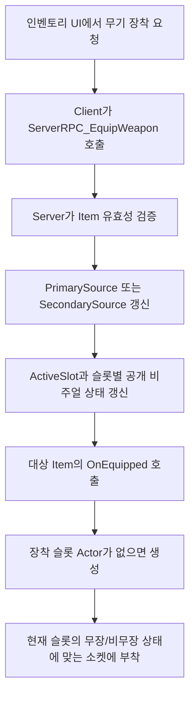
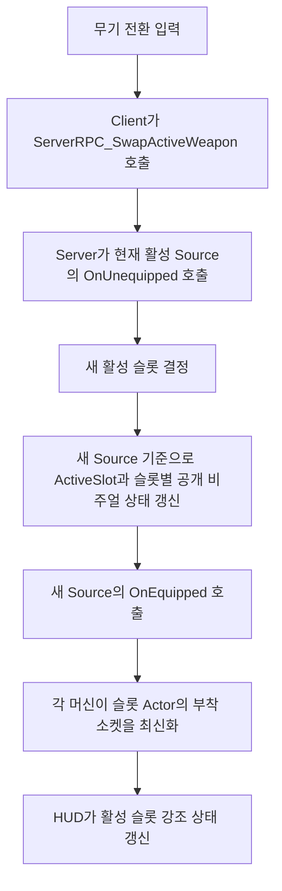
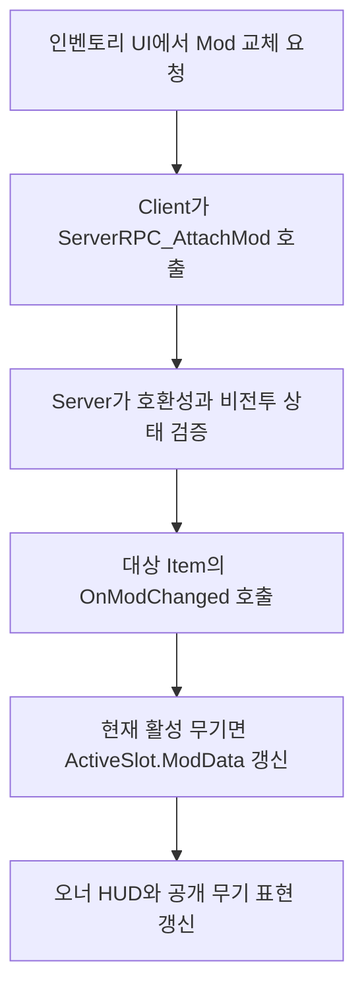
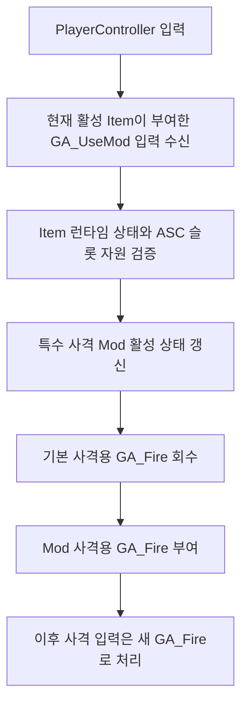

# [시스템 기획] 무기_장비

생성자: 이건주
카테고리: 기획  
생성 일시: 2026년 4월 24일  

> **작성 목적:** `Docs/Private/무기 장착 흐름 R&D.md`에서 확정한 멀티플레이 기준 역할 분담을 반영해 무기 장착, 전환, 사격 프로파일, 슬롯 자원, HUD 계약을 다시 정리한다.
>
> **관련 문서:** `Docs/Private/무기 장착 흐름 R&D.md`, `Docs/[시스템 기획] 무기_모드.md`, `Docs/Private/[상세설계]무기_장비_네트워크.md`

---

## 목차

1. [시스템 목표](#1-시스템-목표)
2. [시스템 범위와 책임 분리](#2-시스템-범위와-책임-분리)
3. [컴포넌트 배치와 데이터 모델](#3-컴포넌트-배치와-데이터-모델)
4. [무기 장착, 전환, Mod 교체 흐름](#4-무기-장착-전환-mod-교체-흐름)
5. [어빌리티 부여와 현재 활성 사격 상태](#5-어빌리티-부여와-현재-활성-사격-상태)
6. [탄약, Mod 자원, 재장전 정책](#6-탄약-mod-자원-재장전-정책)
7. [HUD 상태 제공 계약](#7-hud-상태-제공-계약)
8. [저장과 네트워크 반영 경계](#8-저장과-네트워크-반영-경계)
9. [현 단계 정책 정리](#9-현-단계-정책-정리)

---

## 1. 시스템 목표

무기 장비 시스템의 목표는 `무기를 무엇이 소유하는가`, `현재 어떤 무기가 활성 상태인가`, `플레이어 입력이 어떤 경로로 현재 무기에 도달하는가`를 멀티플레이 기준으로 다시 고정하는 것이다.

본 문서는 아래 경험을 보장해야 한다.

- 인벤토리가 무기 개체의 소유권을 가지되, 런타임 장착 상태는 `WeaponManagerComponent`가 관리하는 경험
- 주무기 슬롯과 보조무기 슬롯의 자원이 `ASC` 기준으로 계속 유지되는 경험
- 장착된 주무기/보조무기 Actor가 무장/비무장 상태에 따라 `Gun_Attach`, `LongGun_Stow`, `Pistol_Stow` 소켓에 안정적으로 붙는 경험
- 특수 사격 Mod가 현재 활성 무기의 사격 상태를 바꾸되, 장비 시스템이 개별 Mod 효과 구현을 직접 알지 않아도 되는 경험
- owner-only 정보와 공개 전투 표현을 분리해 멀티플레이 복제 비용을 제어하는 경험

무기 장비 시스템은 더 이상 `장비 데이터를 저장하는 시스템`, `활성 무기만 남기고 나머지 무기 Actor를 없애는 시스템`, `개별 무기별 입력을 직접 분기하는 시스템`이 아니다. 이 문서 기준의 무기 장비 시스템은 **Inventory 기반 소유권, WeaponManager 기반 슬롯 연결과 무장 상태 관리, Item 기반 어빌리티 생명주기, ASC 기반 슬롯 자원 정본, 슬롯별 WeaponActor 부착 규약**을 연결하는 허브다.

---

## 2. 시스템 범위와 책임 분리

### 2.1 최종 컴포넌트 배치

```text
APRPlayerState
├── UPRInventoryComponent
└── UPREquipmentManagerComponent

APRPlayerCharacter
└── UPRWeaponManagerComponent
```

- `UPRInventoryComponent`는 플레이어가 소유한 무기 Item과 일반 아이템을 보관한다.
- `UPREquipmentManagerComponent`는 방어구, 악세서리, 비무기 장착 요소를 관리한다.
- `UPRWeaponManagerComponent`는 주무기/보조무기 슬롯의 원본 Item 참조와 현재 활성 슬롯만 관리한다.
- 무기 관련 장착 데이터는 더 이상 `EquipmentManager`의 책임으로 두지 않는다.

### 2.2 시스템별 책임

| 주체 | 담당 책임 | 비고 |
| --- | --- | --- |
| `UPRInventoryComponent` | 무기 Item 소유, SubObject 등록/해제, 인벤토리 보유 목록 관리 | PlayerState 소유 |
| `UPREquipmentManagerComponent` | 방어구, 악세서리, 비무기 장착 슬롯 관리 | 무기 데이터 비보관 |
| `UPRWeaponManagerComponent` | `PrimarySource`, `SecondarySource`, `ActiveSlot`, 슬롯별 공개 비주얼 상태 관리, 무기 Actor 스폰/소켓 부착 최신화 | Character 소유 |
| `UPRItemInstance_Weapon` | 무기 정체성, 장착 Mod 구성, ability handle, 장착/해제/Mod 변경 인터페이스, 무기 개체 고유 런타임 상태 | 지속 인스턴스 |
| 플레이어 `ASC` / `AttributeSet_Player` | 슬롯 자원 정본 관리, 차단/취소 판단에 필요한 상태 태그 운용 | 주무기/보조무기 슬롯별 자원 보유 |
| `WeaponActor` | 장착된 슬롯 무기의 로컬 비주얼, `Gun_Attach`/`LongGun_Stow`/`Pistol_Stow` 소켓 부착, 머즐 플래시, 표현 전용 상태 | 슬롯별 로컬 Actor |
| HUD/UI | 슬롯 상태와 현재 활성 무기 상태 표시 | 판단 금지 |

### 2.3 단일 진실 원천

장비 시스템에서는 장착 상태를 여러 곳에 중복 저장하지 않는다.

| 질문 | 정본 |
| --- | --- |
| 플레이어가 어떤 무기 Item을 소유하는가 | `InventoryComponent` |
| 주무기 슬롯에 어떤 무기가 장착되어 있는가 | `WeaponManager.PrimarySource` |
| 보조무기 슬롯에 어떤 무기가 장착되어 있는가 | `WeaponManager.SecondarySource` |
| 지금 손에 들고 있는 활성 무기가 무엇인가 | `WeaponManager.ActiveSlot` |
| 현재 장착된 각 슬롯 무기를 어떻게 보여줘야 하는가 | `WeaponManager.PrimaryVisualSlot`, `WeaponManager.SecondaryVisualSlot` |
| 현재 탄창, 예비 탄약, Mod 게이지, Mod 스택 값은 얼마인가 | 플레이어 `ASC`의 슬롯 Attribute |
| 현재 보여 주는 슬롯별 무기 Actor는 무엇인가 | `WeaponManager.PrimaryWeaponActor`, `WeaponManager.SecondaryWeaponActor` |

- `bIsEquipped` 같은 장착 플래그를 Item 내부에 두지 않는다.
- HUD는 `CurrentWeaponActor` 존재 여부를 장착 판단의 기준으로 삼지 않는다.
- `WeaponActor`는 정본이 아니라, 정본을 읽어 표현하는 로컬 결과물이다.

---

## 3. 컴포넌트 배치와 데이터 모델

### 3.1 무기 Item 인스턴스

`UPRItemInstance_Weapon`는 플레이어가 실제로 소유한 무기 1개의 지속 인스턴스다.

```cpp
UCLASS()
class UPRItemInstance_Weapon : public UPRItemInstance
{
    UPROPERTY() TObjectPtr<UPRWeaponModDataAsset> ModData;

    FPRAbilityHandles WeaponAbilityHandles;
    FPRAbilityHandles ModAbilityHandles;

    void OnEquipped(AActor* OwnerActor);
    void OnUnequipped(AActor* OwnerActor);
    void OnModChanged(AActor* OwnerActor, UPRWeaponModDataAsset* NewMod);
};
```

`UPRItemInstance_Weapon`는 아래 상태를 가진다.

- 무기 DataAsset과 Item 식별자
- 장착된 Mod 연결 상태
- 자신이 부여한 무기 어빌리티와 Mod 어빌리티 핸들
- 장착/해제/Mod 교체 시 실행되는 인터페이스
- `WeaponActor`가 사라져도 유지되어야 하는 무기 개체 고유 런타임 상태

반대로 아래 값은 `UPRItemInstance_Weapon`의 정본이 아니다.

- 현재 탄창 잔탄
- 예비 탄약
- Mod 게이지
- Mod 스택
- 재장전 진행 시간
- 현재 활성 무기 Actor 참조

### 3.2 활성 무기 슬롯 데이터

```cpp
USTRUCT()
struct FPRActiveWeaponSlot
{
    UPROPERTY() EPRWeaponSlotType SlotType;
    UPROPERTY() TObjectPtr<UPRWeaponDataAsset> WeaponData;
    UPROPERTY() TObjectPtr<UPRWeaponModDataAsset> ModData;
};
```

- `ActiveSlot`은 모든 클라이언트가 알아야 하는 현재 활성 무기 1개의 공개 상태다.
- 공개 복제에는 asset reference만 넣고, Item 포인터와 Actor 포인터는 넣지 않는다.
- 비활성 슬롯은 `ActiveSlot`에 포함되지 않는다.

### 3.3 슬롯 자원 모델

플레이어 `ASC`의 `AttributeSet_Player`는 아래 슬롯 자원의 정본을 가진다.

| 슬롯 자원 | 예시 Attribute |
| --- | --- |
| 주무기 탄창 잔탄 | `PrimaryMagazineAmmo` |
| 주무기 예비 탄약 | `PrimaryReserveAmmo` |
| 주무기 Mod 게이지 | `PrimaryModGauge` |
| 주무기 Mod 스택 | `PrimaryModStack` |
| 보조무기 탄창 잔탄 | `SecondaryMagazineAmmo` |
| 보조무기 예비 탄약 | `SecondaryReserveAmmo` |
| 보조무기 Mod 게이지 | `SecondaryModGauge` |
| 보조무기 Mod 스택 | `SecondaryModStack` |

- 슬롯 자원은 `Item`이나 `WeaponActor`에 중복 저장하지 않는다.
- `WeaponManager`는 현재 활성 슬롯 기준으로 어떤 Attribute를 읽고 갱신해야 하는지만 결정한다.

### 3.4 WeaponActor의 위치

장비 시스템에서 `WeaponActor`는 아래 원칙을 따른다.

- 장착된 슬롯마다 `WeaponActor`를 1개씩 로컬 스폰한다.
- 무장 상태의 슬롯 Actor는 `Gun_Attach`에 부착한다.
- 비무장 상태의 주무기 Actor는 `LongGun_Stow`, 보조무기 Actor는 `Pistol_Stow`에 부착한다.
- 무기 전환은 Actor 교체가 아니라 슬롯별 부착 소켓 갱신으로 처리한다.
- 무기를 Unequip 하면 해당 슬롯 Actor를 Destroy 한다.
- 머즐 플래시, 메시, 소켓, 애니메이션 연동, 공개 표현만 담당한다.
- 손에서 내려놓아도 무기가 수납 소켓에 보여야 하는 상태만 가진다.
- 게임플레이 상태의 정본이 아니다.

---

## 4. 무기 장착, 전환, Mod 교체 흐름

### 4.1 장착 흐름



- 장착은 `Inventory` 소유권 이동이 아니라, `WeaponManager`가 특정 Item을 슬롯에 연결하는 행위다.
- Item의 SubObject 소유자는 항상 `InventoryComponent`다.
- 같은 슬롯에 다른 무기를 다시 장착하면 기존 슬롯 Actor는 Destroy 후 새 무기로 재생성한다.
- 장착 직후 현재 활성 슬롯이면 `Gun_Attach`, 비활성 슬롯이면 주무기 `LongGun_Stow`, 보조무기 `Pistol_Stow`에 부착한다.

### 4.2 무기 전환 흐름



- `WeaponManager`는 활성 슬롯 전환만 책임진다.
- 기존 활성 무기의 ability 회수와 새 활성 무기의 ability 부여는 각 Item의 `OnUnequipped`, `OnEquipped`가 담당한다.
- 슬롯 전환은 WeaponActor를 Destroy 하지 않고, 이전 활성 무기를 수납 소켓으로 보내고 새 활성 무기를 `Gun_Attach`로 이동시키는 과정이다.
- 전환 후 비활성 주무기는 `LongGun_Stow`, 비활성 보조무기는 `Pistol_Stow`에 붙는다.

### 4.3 Mod 교체 흐름



- Mod 교체는 무기 Item 단위로 처리한다.
- Mod 교체 시 탄약은 유지하고, Mod 전용 자원은 초기화한다.

### 4.4 무기 전환 시 유지되는 상태와 초기화되는 상태

| 구분 | 상태 | 처리 규칙 |
| --- | --- | --- |
| 유지 | 탄창 잔탄 | 슬롯 자원으로 유지 |
| 유지 | 예비 탄약 | 슬롯 자원으로 유지 |
| 유지 | Mod 게이지 | 슬롯 자원으로 유지 |
| 유지 | Mod 스택 | 슬롯 자원으로 유지 |
| 유지 | 장착된 Mod 구성 | Item 상태로 유지 |
| 유지 | 무기 개체 고유 런타임 상태 | Item 상태로 유지 |
| 유지 | 장착된 슬롯 WeaponActor | 슬롯에 장착되어 있는 동안 유지 |
| 초기화 | 현재 활성 사격 모드 | 비활성화 시 기본 사격으로 복귀 |
| 초기화 | 재장전 진행 | 무기 비활성화 시 즉시 취소 |
| 초기화 | 비지속형 Mod 활성 상태 | 무기 비활성화 시 종료 |
| 갱신 | 무기 Actor 부착 소켓 | 전환 시 무장/비무장 상태에 맞춰 즉시 재부착 |
| 예외 유지 | 버프형/소환형 Mod 효과 | 개별 Mod 정책에 따라 유지 가능 |

- 특수 사격 Mod는 무기 전환 시 항상 기본 사격으로 복귀한다.
- 버프형, 소환형처럼 무기 전환 이후에도 유지되는 효과는 Mod 데이터 정책으로만 예외를 허용한다.

---

## 5. 어빌리티 부여와 현재 활성 사격 상태

### 5.1 어빌리티 부여 주체

무기 장비 시스템에서는 장착/해제 시 어빌리티 부여 주체를 `UPRItemInstance_Weapon`으로 고정한다.

| 인터페이스 | 담당 |
| --- | --- |
| `OnEquipped` | 현재 활성 무기에 필요한 기본 어빌리티와 Mod 관련 어빌리티 부여 |
| `OnUnequipped` | 자신이 부여한 어빌리티와 이펙트 회수 |
| `OnModChanged` | Mod 교체에 맞춰 Mod 어빌리티와 관련 상태 재구성 |

- `WeaponManager`는 슬롯 전환과 `ActiveSlot` 갱신만 담당한다.
- `GE_EquipWeapon`, `GE_UnequipWeapon`는 문서의 외부 계약으로 두지 않고, 필요하면 `OnEquipped`, `OnUnequipped` 내부 구현 수단으로 사용한다.

### 5.2 현재 활성 사격 상태의 소유 방식

현재 활성 사격 상태는 `WeaponActor`의 정본 상태가 아니다.

정의는 아래와 같다.

- 현재 활성 사격 상태는 **활성 무기 Item의 런타임 상태 + 현재 슬롯의 ASC 자원 상태**를 바탕으로 계산되는 파생값이다.
- `GameplayTag`는 재장전 차단, 입력 취소, 상태 차단 같은 실행 판정용 보조 신호로만 사용한다.
- `WeaponActor`는 계산된 결과를 표시하고 연동할 뿐, 최종 소유자가 아니다.

즉, 장비 시스템은 아래 질문을 순서대로 평가해 활성 사격 상태를 계산한다.

1. 현재 활성 `Source`가 누구인가
2. 해당 Item이 기본 사격 상태인가, 특수 사격 Mod 활성 상태인가
3. 현재 슬롯의 Mod 스택과 게이지가 유효한가
4. 현재 활성 사격용 `GA_Fire`가 기본 사격용인가, Mod 사격용인가

### 5.3 특수 사격 Mod 연동 방식

특수 사격 Mod는 `GA_Fire` 자체를 교체하는 방식으로 운용한다.



특수 사격 Mod는 아래 규칙을 따른다.

- Mod 전환 입력 성공 시 기본 사격용 `GA_Fire`를 회수하고 Mod 사격용 `GA_Fire`를 부여한다.
- Mod 종료 시 Mod 사격용 `GA_Fire`를 회수하고 기본 사격용 `GA_Fire`를 다시 부여한다.
- Mod 스택이 0이 되면 자동으로 기본 사격으로 복귀한다.
- 무기 비활성화 시 특수 사격 Mod는 종료되며 기본 사격으로 복귀한다.
- 무기 재장착 시 현재 활성 사격 상태는 기본 사격부터 시작한다.

### 5.4 입력 차단과 상태 전환 규칙

| 상황 | 처리 규칙 |
| --- | --- |
| 재장전 중 Mod 전환 입력 | 재장전을 중단하고 Mod 전환을 우선 처리 |
| 구르기 중 Mod 전환 입력 | 허용 |
| 무기 전환 중 Mod 전환 입력 | 현재 활성 Item이 가진 `GA_UseMod` 기준으로만 처리 |
| 죽음/다운 상태 | 입력 차단 |
| Mod 전환 입력 시 스택 0 | 전환 불가, 기본 사격 유지 |
| Mod 사용 중 스택 0 도달 | 기본 사격으로 자동 복귀 |

---

## 6. 탄약, Mod 자원, 재장전 정책

### 6.1 탄약 및 Mod 자원 정본

본 문서에서 다루는 전투 자원은 모두 슬롯 단위로 관리한다.

| 자원 | 정본 |
| --- | --- |
| 현재 탄창 잔탄 | 플레이어 `ASC` |
| 예비 탄약 | 플레이어 `ASC` |
| Mod 게이지 | 플레이어 `ASC` |
| Mod 스택 | 플레이어 `ASC` |

- 같은 무기를 재초기화할 때는 기존 슬롯 자원을 이어받는다.
- 다른 무기를 새로 장착할 때는 무기 데이터가 정의한 기본 시작값을 사용한다.
- Mod만 교체할 때는 탄약을 유지하고 Mod 게이지/스택만 초기화한다.

### 6.2 탄약 타입

| 탄약 타입 | 사용 무기 |
| --- | --- |
| 소총탄 | 돌격소총 |
| 볼트탄 | 볼트액션 |
| 유탄 | 유탄발사기 |
| 권총탄 | 보조무기 확정 시 사용 |

### 6.3 재장전 규칙

1. 현재 활성 무기의 `GA_Reload`가 입력을 수신한다.
2. `WeaponManager`는 현재 활성 슬롯을 기준으로 슬롯 자원을 읽는다.
3. 재장전 가능 조건을 통과하면 재장전이 시작된다.
4. 재장전 완료 시 `ASC`의 현재 슬롯 Attribute를 갱신한다.
5. 무기 비활성화 시 진행 중 재장전은 즉시 취소된다.

재장전의 세부 규칙은 아래를 따른다.

- 탄창이 가득 차면 재장전을 시작하지 않는다.
- 예비 탄약이 0이면 재장전을 시작하지 않는다.
- 볼트액션은 한 발씩 재장전 규칙을 별도로 적용한다.
- 특수 사격 Mod 전환 입력이 들어오면 재장전을 취소하고 상태 전환을 우선 처리한다.

### 6.4 탄약 및 Mod 자원 리필 정책

- 무기 첫 장착 시 기본 탄창과 기본 예비 탄약을 초기값으로 사용한다.
- 체크포인트, 거점 귀환, 맵 이동 후 전투 재개, 사망 후 복귀 시 리필 정책을 별도로 적용할 수 있다.
- 리필 정책은 슬롯 자원에 직접 반영하며, 무기 Item이나 Actor를 정본으로 삼지 않는다.

---

## 7. HUD 상태 제공 계약

### 7.1 데이터 공급 원칙

HUD는 슬롯 데이터 기준으로 상태를 표시한다.

| 표시 항목 | 데이터 소스 |
| --- | --- |
| 슬롯에 장착된 무기/Mod 정보 | `PrimarySource`, `SecondarySource`, `ActiveSlot` |
| 현재 탄창 잔탄, 예비 탄약 | 플레이어 `ASC`의 슬롯 Attribute |
| Mod 게이지, Mod 스택 | 플레이어 `ASC`의 슬롯 Attribute |
| 현재 활성 사격 상태 | 활성 Item 런타임 상태 + 현재 부여된 `GA_Fire` 결과 |
| 남은 지속 시간, 최근 실패 사유 | 활성 Item 또는 관련 어빌리티 실행 결과 |
| 어느 슬롯이 현재 활성인지 | `ActiveSlot.SlotType` |

### 7.2 HUD 동작 규칙

- HUD는 주무기 슬롯과 보조무기 슬롯을 동시에 표시한다.
- 활성/비활성 판정은 `CurrentWeaponActor`가 아니라 `ActiveSlot.SlotType` 기준으로 처리한다.
- HUD는 현재 사격이 기본 사격인지 Mod 사격인지 자체 추론하지 않는다.
- HUD는 발사 가능 여부, Mod 사용 가능 여부를 직접 판정하지 않는다.
- owner-only 자원은 소유자 HUD에서만 보여 준다.
- 타인에게 보여야 하는 무기 표현과 애니메이션은 공개 복제 경로로 처리한다.

### 7.3 슬롯 강조 규칙

- 활성 슬롯은 하단, 비활성 슬롯은 상단에 배치한다.
- 활성 슬롯은 스케일 1.0, 불투명 상태로 표시한다.
- 비활성 슬롯은 축소 및 반투명 상태로 표시한다.
- 무기 전환 시 두 슬롯의 강조 상태를 서로 반전한다.

---

## 8. 저장과 네트워크 반영 경계

### 8.1 저장 경계

- 인벤토리 저장은 `InventoryComponent`가 담당한다.
- 무기 슬롯 연결 상태는 `WeaponManager`가 저장/복원 대상 데이터로 내보낸다.
- 슬롯 자원은 `ASC` 기준으로 저장 및 복원한다.
- `WeaponActor`는 저장 정본이 아니며, 저장 데이터를 바탕으로 재생성한다.

### 8.2 네트워크 반영 경계

무기 장비 문서는 네트워크 세부를 모두 담지 않는다. 상세 복제 경로와 RPC 흐름은 `Docs/Private/[상세설계]무기_장비_네트워크.md`에서 별도로 관리한다.

본 문서에서 고정하는 고수준 계약은 아래와 같다.

| 요소 | 복제 원칙 |
| --- | --- |
| `InventoryComponent`의 무기 Item | owner-only SubObject 복제 |
| `EquipmentManager` | owner-only 복제 |
| `WeaponManager.ActiveSlot` | 전체 복제 |
| `WeaponManager.PrimaryVisualSlot`, `WeaponManager.SecondaryVisualSlot` | 전체 복제 |
| `WeaponManager.PrimarySource/SecondarySource` | owner-only 복제 |
| `WeaponActor` | 로컬 전용, 각 머신이 슬롯별 공개 비주얼 상태 기준으로 자체 스폰/부착 |
| 순간 이펙트 | 예측 + Multicast |

- 공개 상태에는 슬롯별 asset reference와 무장/비무장 상태를 넣는다.
- Actor 포인터를 공개 복제의 정본으로 사용하지 않는다.
- 지속 상태는 Replicated Property로, 순간 이벤트는 Multicast로 다룬다.

---

## 9. 현 단계 정책 정리

| 항목 | 현재 정책 |
| --- | --- |
| 무기 소유권 | `InventoryComponent`가 소유 |
| 방어구/악세서리 관리 | `EquipmentManager` 담당 |
| 무기 슬롯 정본 | `PrimarySource`, `SecondarySource` |
| 현재 활성 무기 정본 | `ActiveSlot` |
| 슬롯 무기 Actor 정책 | 장착된 슬롯마다 Actor 유지, 무장 상태는 `Gun_Attach`, 비무장 상태는 주무기 `LongGun_Stow`, 보조무기 `Pistol_Stow`, Unequip 시 Destroy |
| 게임플레이 상태 정본 | `Item`, `ASC`, `GAS` 조합 |
| 어빌리티 부여 주체 | `UPRItemInstance_Weapon` |
| `GE_EquipWeapon`, `GE_UnequipWeapon` | 외부 계약이 아니라 Item 내부 구현 수단 |
| 현재 활성 사격 상태 | 활성 Item 런타임 상태 + ASC 자원 상태를 바탕으로 계산되는 파생값 |
| 특수 사격 Mod 연동 | `GA_Fire` 자체를 교체 |
| 무기 전환 정책 | 슬롯 자원 유지, 활성 실행 상태 초기화 |
| HUD 기준 | 슬롯 데이터 기준 |
| 네트워크 상세 | 별도 private 문서에서 관리 |

---

> 무기 모드의 개별 효과 분류, 버프형/소환형/즉발형 패턴 세부, 개별 Mod 전투 로직은 `Docs/[시스템 기획] 무기_모드.md`에서 다룬다. 본 문서는 무기 장비 시스템이 Mod와 접속되는 소유권, 입력, 슬롯 자원, HUD, 복제 경계를 다룬다.

---

*본 문서는 `무기 장착 흐름 R&D.md`를 기준으로 정리한 기획안이며, 후속 상세 설계와 구현 과정에서 조정될 수 있다.*
