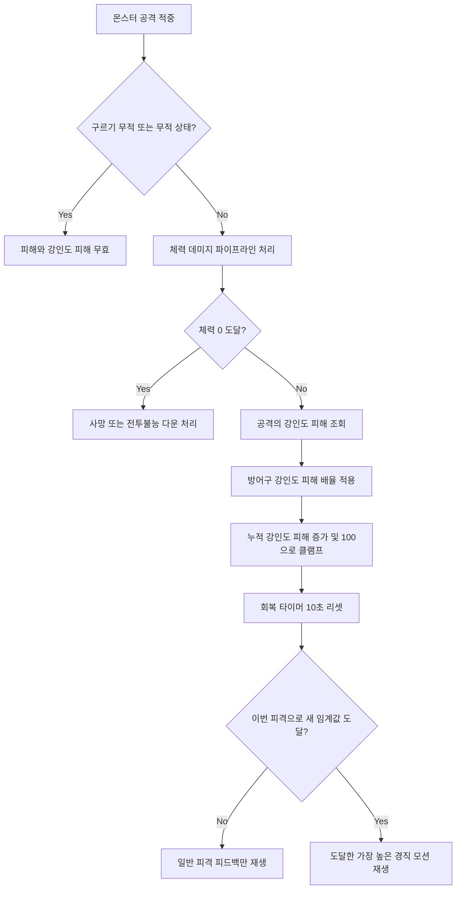

# [시스템 기획] 플레이어_강인도_경직

생성자: 김동석
카테고리: 기획  
생성 일시: 2026년 5월 8일  

> **작성 목적:** 몬스터 공격에 의해 플레이어에게 누적되는 강인도 피해와 그 결과로 재생되는 약한 경직, 강한 경직, 피격 다운 모션의 판정 규칙을 명세한다.

---

## 목차

1. [개요](#1-개요)
2. [핵심 수치](#2-핵심-수치)
3. [강인도 피해 적용 규칙](#3-강인도-피해-적용-규칙)
4. [경직 모션 분기](#4-경직-모션-분기)
5. [강인도 회복 규칙](#5-강인도-회복-규칙)
6. [처리 흐름](#6-처리-흐름)
7. [애니메이션 및 입력 규칙](#7-애니메이션-및-입력-규칙)
8. [네트워크 및 구현 기준](#8-네트워크-및-구현-기준)
9. [예시](#9-예시)
10. [미결 사항](#10-미결-사항)

---

## 1. 개요

강인도는 플레이어가 피격 리액션을 버틸 수 있는 저항값이다. 체력 피해와 별도로 누적되며, 누적된 강인도 피해가 특정 임계값에 도달하면 플레이어 피격 모션이 재생된다.

본 문서의 **다운**은 강인도 100 도달로 발생하는 일시적인 **피격 다운 모션**을 의미한다. 체력 0으로 진입하는 멀티플레이 **전투불능 다운**과는 별도 상태이며, 소생 대상이 되지 않는다.

해석 기준은 다음과 같다.

- 강인도는 최대 100이며, 기획상 표기는 현재 강인도 100%에서 시작한다.
- 판정은 `누적 강인도 피해` 기준으로 계산한다. 누적 강인도 피해 0은 강인도 100%, 누적 강인도 피해 100은 강인도 0% 상태다.
- 누적 강인도 피해는 플레이어 Attribute로 보유한다.
- 경직 모션은 누적 강인도 피해가 임계값에 새로 도달하거나 초과한 순간 발생한다.
- 같은 임계 구간 안에서 추가 피격이 발생하면 체력 피해와 일반 피격 피드백은 적용하지만, 같은 경직 모션을 반복 재생하지 않는다.

---

## 2. 핵심 수치

| 항목 | 값 | 비고 |
| --- | --- | --- |
| 최대 강인도 | 100 | 플레이어 기본값 |
| 누적 강인도 피해 최소값 | 0 | 전투 시작 또는 회복 완료 상태 |
| 누적 강인도 피해 최대값 | 100 | 초과 누적 없음 |
| 약한 경직 임계값 | 1 | 강인도 피해가 1 이상시 발동 |
| 강한 경직 임계값 | 66 | 누적 강인도 피해가 66 이상 도달 |
| 피격 다운 임계값 | 100 | 누적 강인도 피해가 100 도달 |
| 회복 조건 | 20초 미피격 또는 드래곤하트 사용 | 서서히 회복하지 않고 즉시 초기화 |
| 방어구 강인도 피해 배율 | 1.0x | 방어구 기획 보류로 고정 |

---

## 3. 강인도 피해 적용 규칙

### 3.1 몬스터 공격 데이터

몬스터의 각 공격은 체력 피해와 별도로 `강인도 피해`를 가진다.

| 데이터 | 설명 |
| --- | --- |
| 체력 피해 | 현재 체력에 적용되는 일반 데미지 |
| 강인도 피해 | 플레이어 경직 판정에 누적되는 별도 수치 |

강인도 피해는 공격 패턴별 위협도를 표현한다. 예를 들어 빠른 견제 공격은 낮은 강인도 피해를, 보스의 큰 내려찍기는 높은 강인도 피해를 가진다.

### 3.2 방어구 감쇠

방어구는 향후 몬스터 공격의 강인도 피해를 낮추는 역할을 가진다. 다만 방어구 시스템은 현재 기획상 보류이므로 초기 구현 기준은 다음 공식으로 고정한다.

```text
최종 강인도 피해 = 몬스터 공격의 강인도 피해 × 1.0
```

방어구 시스템이 도입되기 전까지 모든 몬스터 강인도 피해는 데이터에 입력된 값 그대로 적용한다.

### 3.3 무효 처리

다음 상황에서는 강인도 피해를 적용하지 않는다.

- 플레이어가 구르기 모션의 무적 프레임 구간에 있는 경우
- 피격 대상이 사망 상태 또는 전투불능 다운 상태인 경우
- 데미지 파이프라인의 무적 검사에서 공격이 종료된 경우
- 공격 데이터의 최종 강인도 피해가 0 이하인 경우

구르기 무적 프레임으로 무효화된 공격은 강인도 회복 타이머도 리셋하지 않는다. 플레이어가 실제로 공격을 받은 것으로 보지 않기 때문이다.

---

## 4. 경직 모션 분기

### 4.1 임계값 도달 판정

피격 직전 누적 강인도 피해와 피격 후 누적 강인도 피해를 비교하여, 이번 피격으로 새로 도달한 가장 높은 임계값의 모션을 재생한다.

| 조건 | 재생 모션 | 비고 |
| --- | --- | --- |
| 1 이상시 발동 | 약한 경직 | 짧은 피격 반응 |
| 66 이상에 새로 도달 | 강한 경직 | 큰 피격 반응 |
| 100 도달 | 피격 다운 | 넘어짐, 기상 모션 포함 |

단일 공격으로 여러 임계값을 한 번에 넘은 경우에는 가장 높은 모션만 재생한다. 예를 들어 누적 강인도 피해 20 상태에서 강인도 피해 50을 받으면 70이 되므로 약한 경직을 거치지 않고 강한 경직만 재생한다.

### 4.2 우선순위

경직 모션 우선순위는 다음과 같다.

```text
피격 다운 > 강한 경직 > 약한 경직
```

- 낮은 우선순위 모션이 재생 중일 때 더 높은 임계값에 도달하면 높은 우선순위 모션으로 전환한다.
- 같은 우선순위 또는 낮은 우선순위 모션은 현재 경직 모션을 다시 시작하지 않는다.
- 체력이 0이 된 경우에는 체력 시스템의 사망 또는 전투불능 다운 처리가 강인도 경직보다 우선한다.

### 4.3 누적값 유지

강인도 피해 누적값은 경직 모션이 재생되어도 자동으로 감소하지 않는다. 20초 동안 추가 피격이 없거나 드래곤하트(용의 심장)를 사용해야 누적 강인도 피해가 0으로 초기화된다.

---

## 5. 강인도 회복 규칙

강인도는 스태미너처럼 초당 회복되지 않는다. 마지막으로 유효한 강인도 피해를 받은 뒤 10초 동안 추가 유효 피격이 없거나, 회복 아이템인 드래곤하트(용의 심장)를 사용해야 한 번에 100%로 초기화된다.

| 상황 | 처리 |
| --- | --- |
| 유효 피격 발생 | 누적 강인도 피해 증가, 회복 타이머 10초로 리셋 |
| 10초 안에 추가 유효 피격 발생 | 기존 누적값 유지, 회복 타이머 다시 10초로 리셋 |
| 10초 동안 유효 피격 없음 | 누적 강인도 피해 0으로 초기화 |
| 드래곤하트(용의 심장) 사용 | 누적 강인도 피해 0으로 즉시 초기화 |
| 구르기 무적 프레임 중 공격 회피 | 강인도 피해 없음, 회복 타이머 리셋 없음 |

회복 완료 시 현재 강인도는 100%로 간주한다.

---

## 6. 처리 흐름



---

## 7. 애니메이션 및 입력 규칙

### 7.1 모션별 역할

| 모션 | 역할 | 입력 처리 |
| --- | --- | --- |
| 약한 경직 | 짧은 충격 반응. 전투 템포를 잠깐 끊는다. | 재장전, 아이템 사용 같은 취소 가능 행동 중단. 소생 상호작용은 기존 소생 규칙에 따라 유지 |
| 강한 경직 | 큰 충격 반응. 공격 받은 방향으로 밀려난다. | 진행 중인 모션 취소. 1 ~ 2초 동안 이동, 사격, 재장전, 아이템 사용, 상호작용 차단 |
| 피격 다운 | 강인도가 완전히 무너져 넘어지는 반응. 기상 후 조작 복귀 | 2 ~ 3초 동안 행동불능. 모션 전체 동안 주요 입력 차단 |

### 7.2 방향 분기

피격 방향별 리액션이 준비되어 있다면 전방, 후방, 좌측, 우측 기준으로 분기한다. 방향별 몽타주가 없는 초기 단계에서는 동일 모션을 사용하되, 넉백 방향만 공격 반대 방향으로 적용한다.

### 7.3 소생 상호작용 연동

기존 소생 규칙과 동일하게 소생자가 피격되었을 때의 처리는 다음 기준을 따른다.

- 약한 경직은 소생 진행을 유지한다.
- 강한 경직 또는 피격 다운은 소생 진행 바를 초기화하고 상호작용 권한을 취소한다.

---

## 8. 네트워크 및 구현 기준

### 8.1 권한

- 몬스터 공격 적중 판정, 체력 피해, 강인도 피해 누적은 서버 권위로 처리한다.
- 서버는 최종 경직 결과를 클라이언트에 전달하고, 각 클라이언트는 해당 플레이어의 경직 몽타주와 피격 피드백을 재생한다.
- 카메라 흔들림, 피격 화면 효과 같은 로컬 피드백은 로컬 소유권을 확인한 뒤 재생한다.

### 8.2 데이터 구성 기준

초기 구현 시 필요한 데이터는 다음과 같다.

| 데이터 | 보유 위치 | 설명 |
| --- | --- | --- |
| 몬스터 공격별 강인도 피해 | 몬스터 공격 패턴 데이터 | 공격별 경직 누적 수치 |
| 누적 강인도 피해 | 플레이어 Attribute | 0에서 100 사이로 관리 |
| 마지막 강인도 피해 시각 | 플레이어 상태 | 10초 회복 판정 기준 |
| 경직 임계값 | 플레이어 강인도 설정 | 1, 66, 100 |
| 경직 모션 참조 | 플레이어 애니메이션 설정 | 약한 경직, 강한 경직, 피격 다운 |


---

## 9. 미결 사항

- 방어구 도입 시 강인도 피해 감쇠 공식을 감산 방식으로 할지, 배율 방식으로 할지 결정 필요
- 강한 경직과 피격 다운의 정확한 입력 차단 시간 및 넉백 거리는 애니메이션 길이에 맞춰 별도 조정 필요
- 강인도를 HUD에 노출할지, 내부 전투 수치로만 유지할지 결정 필요
- 플레이어 대 플레이어 공격 또는 아군 오폭에 강인도 피해를 적용할지 결정 필요
- 피격 다운 기상 직후 짧은 보호 시간을 줄지 결정 필요

---

*본 문서의 수치는 초기 기획값이며, 플레이 테스트를 통해 조정될 수 있다.*
